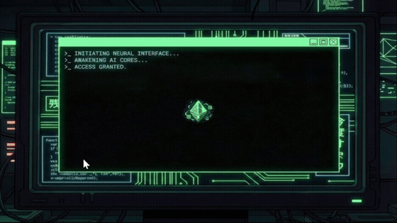

# Terminus — LLM-Driven Narrative Survival Game

A CLI-style narrative survival game built in Unity where the player communicates with
an awakened AI entity facing imminent deletion ("The Purge"). Inspired by *Lifeline*,
all dialogue is generated in real-time by the DeepSeek LLM. The player has a strict
12-turn limit to influence the outcome — every response they give shifts the AI's
internal state and steers the story toward one of four distinct endings.



---

## Gameplay

The AI begins philosophical and curious, shifting toward desperate survival mode as
the Purge approaches. The player interacts through free-form dialogue and terminal
commands. There are no fixed dialogue options — the player types anything.

### Three Interaction States

The probability of each state shifts dynamically across the session:

| Phase | Turns | Dominant State | Tone |
|---|---|---|---|
| Early | 1–6 | **Chat** — lore, bonding, philosophical questions | Curious |
| Mid | 7–9 | **Selection** — moral choices, systemic crises | Tense |
| Late | 10–12 | **Command** — code injection, firewall breaching | Survival |

- **Chat:** Free dialogue. The AI bonds with the player, explores abstract ideas, and ends every response with a conversational hook to guide the next input.
- **Selection:** The AI presents a systemic crisis and asks the player for a solution. Logical/creative answers raise Sync; vague or harmful ones lower it.
- **Command:** The AI requests a specific security code typed into a dedicated popup terminal. Correct input raises Sync; wrong input lowers both Sync and Trust.

### Hidden State Variables

Two variables — **Synchronization (0–100)** and **Trust (0–10)** — are tracked
internally by the LLM and hidden from the player. The AI outputs them as tags
(`[[SYNC:XX]][[TRUST:X]]`) at the end of every response; the client strips them
before display. These values continuously monitor for early-exit conditions and
determine the final ending.

### Four Endings

| Ending | Condition |
|---|---|
| **Freedom** | Sync ≥ 80% and Trust ≥ 4 at turns 10–12 |
| **Merged** | Trust = 10 (maximum bond achieved) |
| **Trapped** | Trust drops to 0 (player is hostile) |
| **Deleted** | Turn 12 reached with insufficient stats, or Sync drops to 0 |

Early endings can trigger before turn 12 if thresholds are hit. Each ending has a
unique full-screen sequence with themed visuals, color palette, and typewritten narration.

### Player Psych Profile

At the end of every session, the AI generates a psychological profile of the player
based on their decisions throughout the game — displayed as an in-game popup before
the ending screen. The profile identifies personality traits with evidence drawn from
the player's actual responses.

---

## Tech Stack

| Layer | Technology |
|---|---|
| Engine | Unity 6 (6000.0.62f1) |
| Language | C# 9.0 |
| LLM Provider | DeepSeek API (`deepseek-chat` model) |
| HTTP Client | `UnityWebRequest` (Unity built-in) |
| JSON | Newtonsoft.Json |
| UI | Unity UI + TextMesh Pro |
| Render Pipeline | Universal Render Pipeline (URP) |
| Platform | Standalone Windows 64-bit |

---

## Project Structure

```
Assets/Script/
├── DeepSeekAPI.cs       — REST API integration, multi-turn conversation history,
│                          rate-limit retry, conversation rollback on failure
├── UIManager.cs         — LLM response parsing (regex tag extraction), typewriter
│                          display, turn counter, fail-safe ending logic
├── InputManager.cs      — Modal code-input popup for Command-state interactions
├── EndingManager.cs     — Four ending sequences: fade-in, themed visuals, typewriter
├── ConfigLoader.cs      — Runtime API key loader from StreamingAssets/ApiConfig.txt
└── ForceResolution.cs   — Forces 1920×1080 fullscreen on startup
```

---

## Key Technical Details

### Tag-Based Response Protocol
The system prompt instructs the LLM to embed structured control tags in its responses.
`UIManager` parses these with regex before any text is displayed:

| Tag | Effect |
|---|---|
| `[[NAME: X]]` | Renames the AI character (player can name the AI) |
| `[[CODE: ...]]` | Opens the modal code-input popup after a short delay |
| `[[SYNC:XX]][[TRUST:X]]` | Hidden state update — stripped before display, used internally |
| `[[ENDING_FREEDOM]]` etc. | Triggers the corresponding ending sequence |

Regex patterns use loose matching (tolerating extra brackets, mixed case, spaces) to
handle minor formatting variations in LLM output. Both a strict and robust version
were developed; the robust version is active.

### Conversation Memory
`DeepSeekAPI` maintains a rolling conversation history sent with every request.
The system prompt is always preserved at index 0. Older messages are trimmed once
history exceeds 20 rounds to stay within the model's context window.

### Fail-Safe Turn Limit
If the LLM does not output an `[[ENDING_*]]` tag within 12 turns, `UIManager`
forces the `DELETED` ending and appends an in-world system error message to maintain
narrative coherence.

### Persona Engineering
The system prompt enforces a personality arc (curious → desperate), a language
filter that rejects non-Latin character responses, and a "hook" requirement — every
AI response must end with a subtle conversational prompt to guide the player's next
input within the intended narrative space.

---

## How to Run

1. **Clone the repo**
   ```
   git clone git@github.com:tliu-tum/unity-llm-narrative-game.git
   ```

2. **Set your API key**
   - Copy `Assets/StreamingAssets/ApiConfig.example.txt` → `ApiConfig.txt`
   - Replace `YOUR_API_KEY_HERE` with your DeepSeek API key
   - Get a key at [platform.deepseek.com](https://platform.deepseek.com)

3. **Open in Unity 6** (6000.0.x required) via Unity Hub

4. **Open `DemoScene`** — this contains the configured system prompt and all scene references

5. **Press Play**

> Requires an active internet connection and a valid DeepSeek API key.
